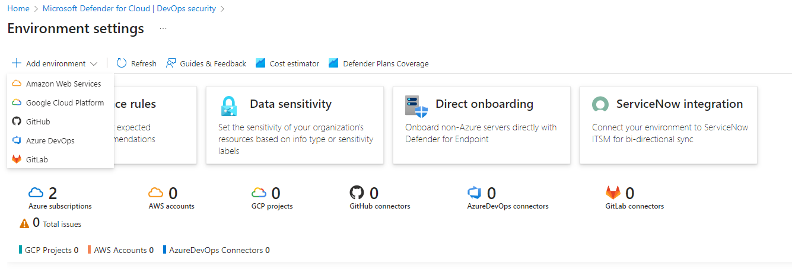
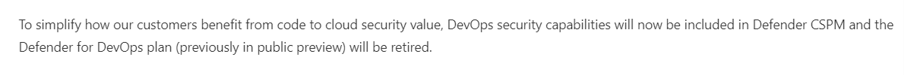
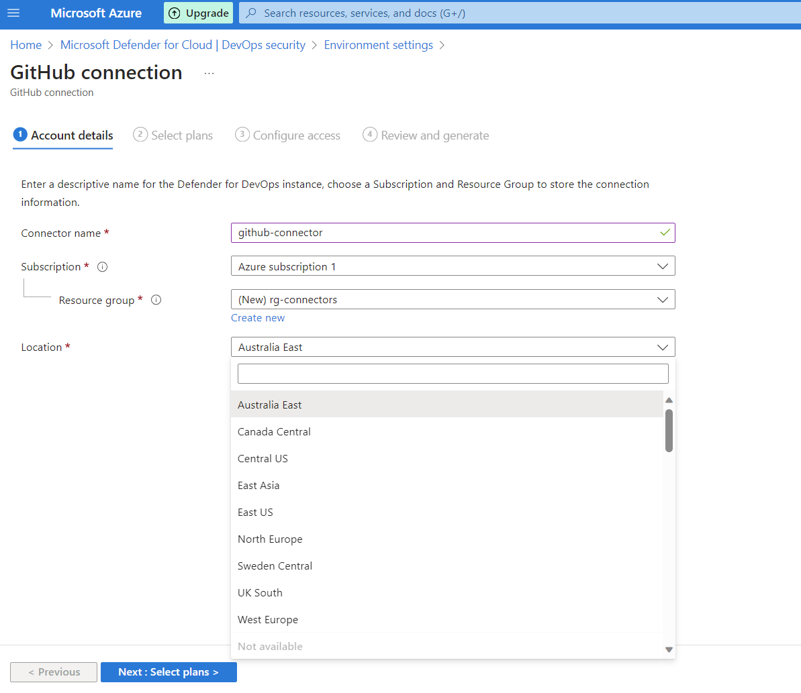
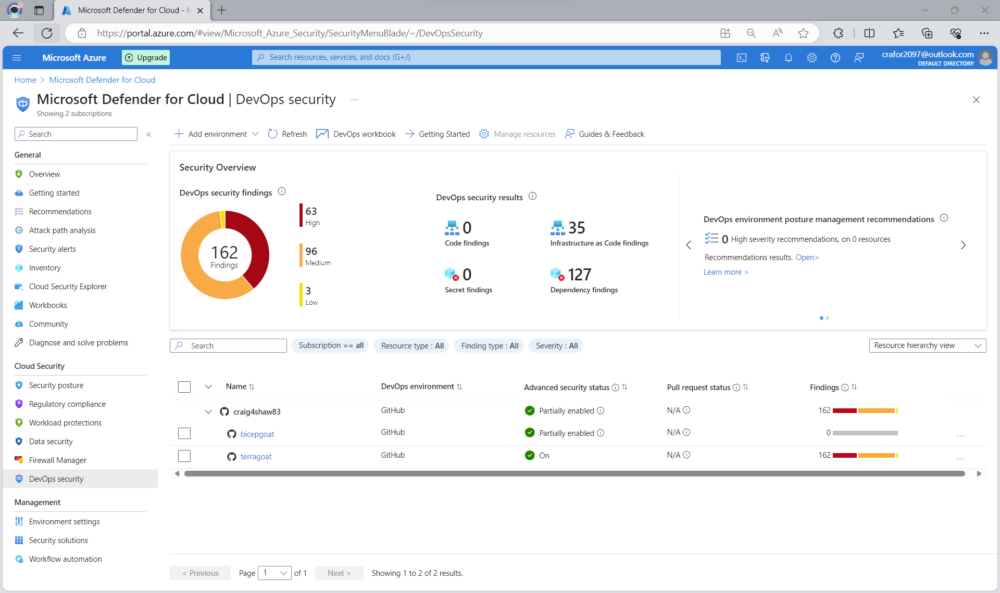
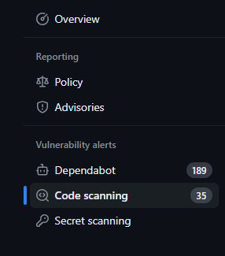
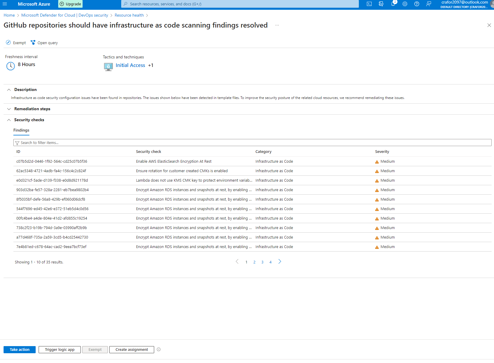

+++
title = 'DevOps Security with Microsoft Defender for Cloud'
date = '2024-01-24T10:00:00+02:00'
draft = false
tags = ['Microsoft Security', 'Defender for Cloud', 'DevSecOps', 'Azure', 'Infrastructure as Code']
description = 'Microsoft updated the DevOps security offering in Defender for Cloud - exploring the new features and capabilities'
+++

Following Microsoft Ignite in Nov 2023, Defender for DevOps has now become DevOps security. In practice this means that a lot of the features which were previously in public preview are now generally available. 

But first… what is DevOps security in Defender for Cloud?

## DevOps Security

This feature of Defender for Cloud provides end-to-end security for code-based deployments from the well-known major source code repositories available in the market. These can be selected from the environment settings of the DevOps security blade in Defender for Cloud with GitLab being the most recent addition to the environment list.



## Licensing

The licensing model has been incorporated into the Defender CSPM plans where the functionality varies based on whether you are using the free foundational CSPM or billable Defender CSPM license.



What does this mean? Starting March 1, 2024, [Defender CSPM](https://learn.microsoft.com/en-gb/azure/defender-for-cloud/concept-cloud-security-posture-management) must be enabled to have premium DevOps security capabilities which include:

- Code-to-cloud contextualization powering security explorer and attack paths
- Pull request annotations for Infrastructure-as-Code security findings

Using the Foundational CSPM license will continue to have some functions such as allowing you to connect your repositories and providing GitHub advanced security recommendations in the portal (which is free for public repos) but this will not have any coverage for IaC. Only the CodeQL findings in GitHub are supported.

If you want the full benefit of the product you will need the Defender CSPM license. More detailed info on what is supported on each license tier can be found here:

[Support and prerequisites — Microsoft Defender for Cloud](https://learn.microsoft.com/en-gb/azure/defender-for-cloud/devops-support?WT.mc_id=Portal-Microsoft_Azure_Security_DevOps)

## Connector

To start you need to connect your repos to Defender for Cloud via a connector. In order to do this, you need contributor level access or Security admin permissions on the Azure subscription that is running Defender for Cloud. For your source code environments, the permissions are as follows:

- **GitHub** — Organisation owner
- **Azure DevOps** — Project collection admin
- **GitLab** — Group owner

The connector now supports more regions than during the public preview. More regions should come online as Microsoft rolls this out across more of their Azure regional datacenters.



For both GitHub and Azure DevOps you can have multiple connectors for the same source code platform at different levels in the hierarchy. For example, in GitHub a connector per org or repo or for Azure DevOps per org, project or repo. For GitLab only one instance of a GitLab group can be onboarded to the Azure Tenant you are creating a connector in currently as this feature is in preview.

## Portal

The overall look and feel of the portal got a makeover. For example, the security overview shows the DevOps security results from code, secrets, dependencies and IaC findings. Repos can also be structured into a hierarchical view for ease of navigation.



## Microsoft Security DevOps

Microsoft Security DevOps is a command line application that integrates static analysis tools into the development lifecycle. It uses the open source tools to scan the pipeline run or action to check for vulnerabilities in code. It is a key component of Defender CSPM especially concerning IaC code scanning as both Terrascan for Terraform and Template Analyser for Bicep/ARM templates are included here.

The sample workflow is available for both Azure DevOps and GitHub actions. In the following steps I will focus on the GitHub action.

You need to copy and paste the sample workflow into your pipeline job and commit it to commence the analysis. 

**Note:** I've added permissions that are needed to ensure security events are written to the GitHub security tab. These are not included in the standard template.

```yaml
name: MSDO
on:
  push:
    branches:
      - main
jobs:
  sample:
    name: Microsoft Security DevOps Analysis
    # MSDO runs on windows-latest.
    # ubuntu-latest also supported
    runs-on: windows-latest
    permissions:
      actions: read
      contents: read
      security-events: write
    steps:
      # Checkout your code repository to scan
      - uses: actions/checkout@v3
      
      # Run analyzers
      - name: Run Microsoft Security DevOps Analysis
        uses: microsoft/security-devops-action@latest
        id: msdo
        with:
          # config: string. Optional. A file path to an MSDO configuration file ('*.gdnconfig').
          # policy: 'GitHub' | 'microsoft' | 'none'. Optional. The name of a well-known Microsoft policy.
          # categories: string. Optional. A comma-separated list of analyzer categories to run. 
          #   Values: 'secrets', 'code', 'artifacts', 'IaC', 'containers'. Example: 'IaC,secrets'. 
          #   Defaults to all.
          # languages: string. Optional. A comma-separated list of languages to analyze. 
          #   Example: 'javascript,typescript'. Defaults to all.
          # tools: string. Optional. A comma-separated list of analyzer tools to run. 
          #   Values: 'bandit', 'binskim', 'eslint', 'templateanalyzer', 'terrascan', 'trivy'.
      
      # Upload alerts to the Security tab
      - name: Upload alerts to Security tab
        uses: github/codeql-action/upload-sarif@v2
        with:
          sarif_file: ${{ steps.msdo.outputs.sarifFile }}
      
      # Upload alerts file as a workflow artifact
      - name: Upload alerts file as a workflow artifact
        uses: actions/upload-artifact@v3
        with:
          name: alerts
          path: ${{ steps.msdo.outputs.sarifFile }}
```

## Investigate Findings

Once you have run the pipeline task the results should appear quickly in the GitHub security tab of your repo under 'Code scanning'.



For the reporting to be visible in Defender it will take some time for the results to be populated under 'Findings' which includes all code, IaC, secret and dependency findings together.


You can then click into the findings to get a complete list of recommendations for remediation.



You are now ready to remediate these fixes in your code! So how do we do that? Well look out for my next blog post which will cover these steps :-)

## Summary

In summary, Defender DevOps Security is available for organisations to help identify and remediate issues in code before they are deployed to your environments. This provides a key security monitoring and remediation capability for code which Microsoft previously was lacking. It will be interesting to follow the development of this feature moving forward.

---

*Originally published on [Medium](https://medium.com/@craig4shaw/devops-security-with-microsoft-defender-for-cloud-aaecae244750) on January 24, 2024*
