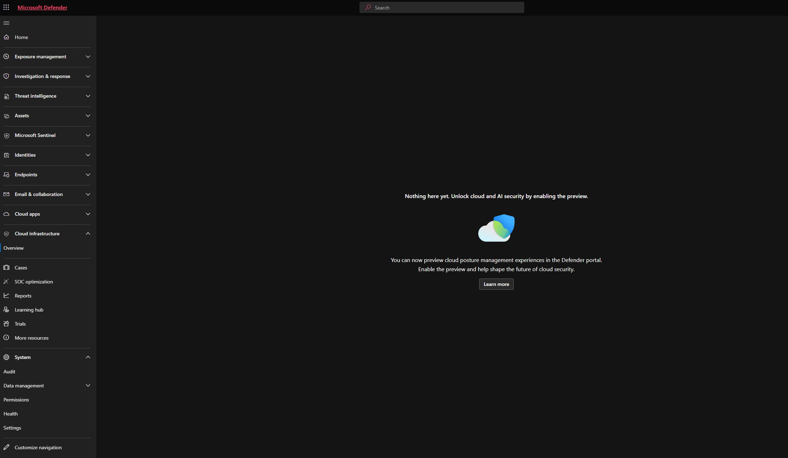
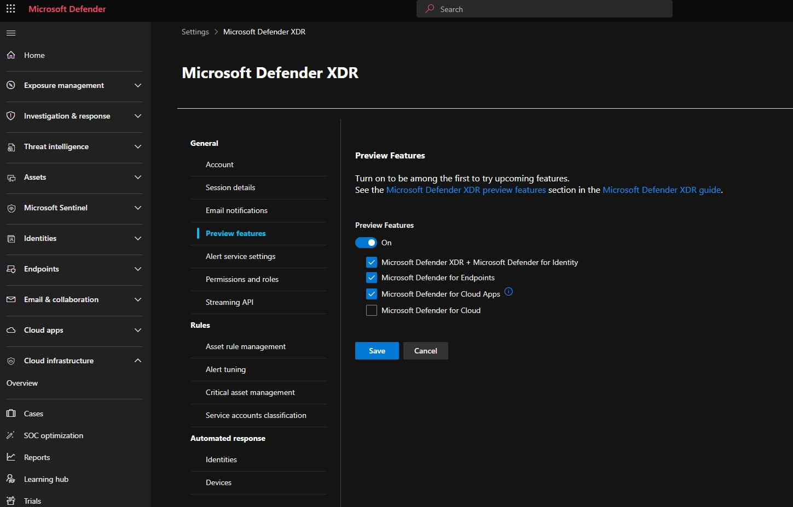
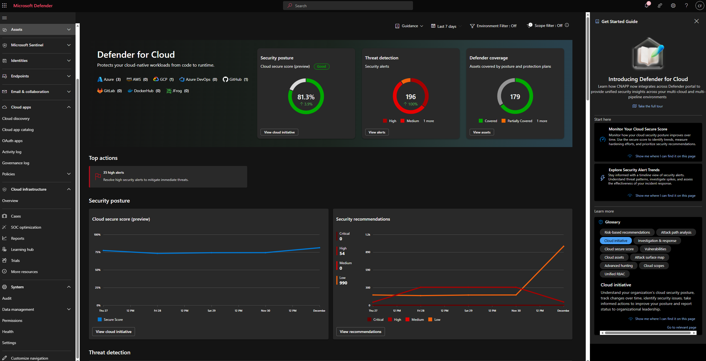
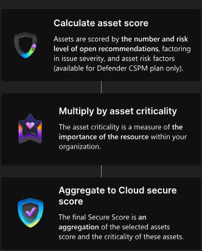
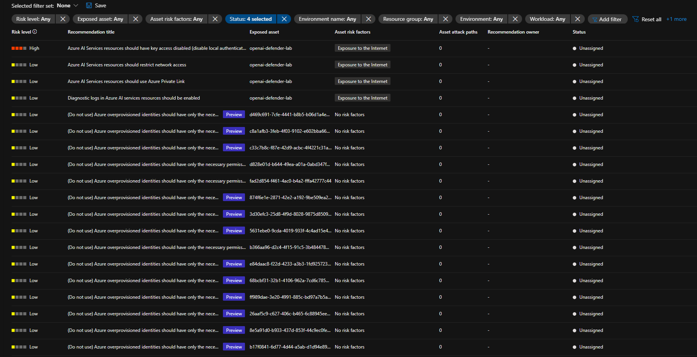
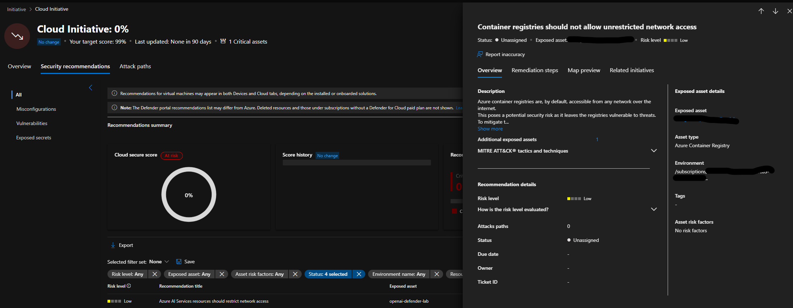
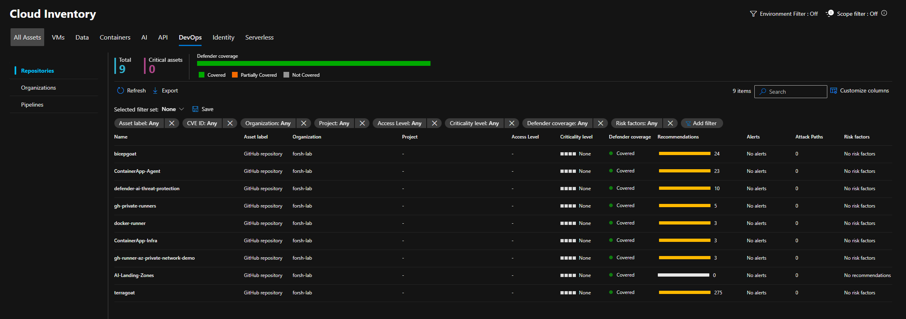

+++
title = 'Enabling the Defender for Cloud Unified Security Portal'
date = '2025-12-03T09:00:00+00:00'
draft = false
slug = 'enabling-defender-for-cloud-unified-portal'
tags = ['Microsoft Security', 'Defender for Cloud', 'Defender XDR', 'DevSecOps', 'Azure', 'Infrastructure as Code']
description = 'Enable Defender for Cloud features in the Microsoft Defender unified security portal'
+++

At Ignite 2025, Microsoft announced that Defender for Cloud is now available in the Microsoft Defender unified security portal ([security.microsoft.com](https://security.microsoft.com/)).

This integration brings a single pane of glass experience across the Microsoft security product line. Security teams who don't necessarily work directly with Azure workload deployments can now view important security metrics concerning:

- asset vulnerabilities
- attack paths
- secure scores
- prioritized security recommendations

## Prerequisites

Before enabling this feature, ensure you have:

- An active Microsoft Defender for Cloud subscription
- Appropriate permissions to access preview features in the Microsoft Defender portal
- Reader access or higher to the Azure subscriptions you want to monitor

## Enabling the experience
You will have noticed that there is a new menu called **Cloud Infrastructure** in the security portal. When selecting the overview, you're presented with the option to enable the feature.

To enable the feature, navigate to **System** > **Settings** > **Preview Features** and enable 'Microsoft Defender for Cloud'.

Once you have enabled the feature, you can navigate to the Cloud Infrastructure overview page to view the dashboard metrics from Defender for Cloud.

## Dashboard highlights

The overview dashboard is quite detailed. Let me highlight some of the most useful features to help you get started with the new menu.

### New cloud secure score

The new cloud secure score model introduces asset risk factors and asset criticality into the calculation. This produces a more accurate environment score by weighting the amount and severity of open recommendations against resource criticality in your organization.

### Recommendations

The recommendations you're familiar with from Defender for Cloud are available in the unified portal. The filtering experience has been significantly improved. In the Azure portal, drilling down into issues often resets the filters, which has been a major pain point. 

In the unified portal, the details now open within the same window, allowing your filters to remain in place throughout your investigation.

### Cloud inventory

This overview is one of my favourite updates as you can easily switch between the technology domains that Defender is monitoring. The below example shows DevOps security, which covers all repositories, organizations, and pipelines connected to Defender for Cloud. 

The other categories cover: VMs, data, containers, AI, identity, and serverless, with subcategories for monitoring within each technology domain. 

## Role-based access control

The unified portal introduces granular RBAC roles, allowing you to tailor access based on team responsibilities. This is particularly useful for organizations with specialized security teams.

For example:
- A **data platform team** may only need visibility into database and storage resources
- A **SOC team** might require broad visibility across multiple project areas and subscriptions
- **Application teams** can focus on their specific workloads without accessing the entire security landscape

This granular approach ensures teams see relevant security information without being overwhelmed by data outside their scope. 

## Important considerations

While the unified portal experience is impressive, the Azure portal remains essential for certain tasks. Currently, you cannot:

- Enable security policies in subscriptions
- Connect code repositories
- Configure CSPM plans
- Access some of the more technical configuration details

The Azure portal is still more feature-rich and provides deeper technical detail for cloud security engineers working on configuration and policy management.

## Summary

The Defender for Cloud integration into the Microsoft Defender portal is a valuable addition for central security teams. It provides:

- Unified visibility across Microsoft security products
- Improved filtering and navigation
- Role-based views tailored to team responsibilities
- A cleaner dashboard experience for executive visibility

Think of this as a complementary view rather than a replacement. Security operations teams will appreciate the consolidated dashboard, while cloud engineers will still rely on the Azure portal for deep configuration work. It's perfect for that big screen in your SOC!
