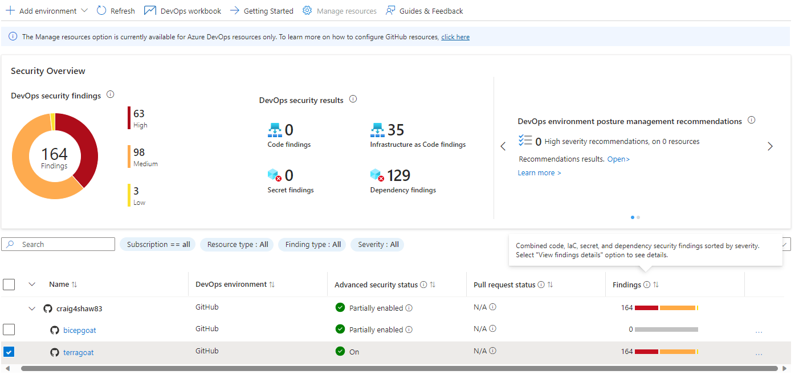
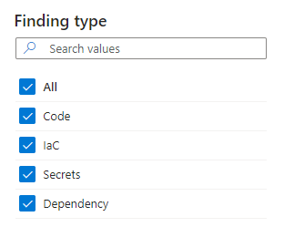
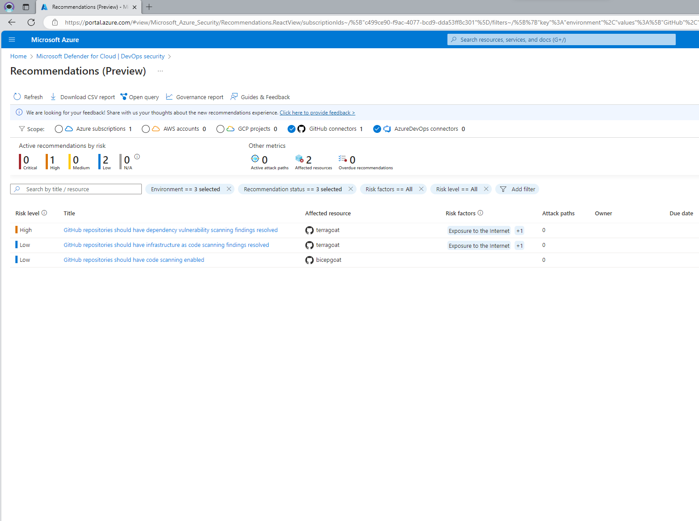
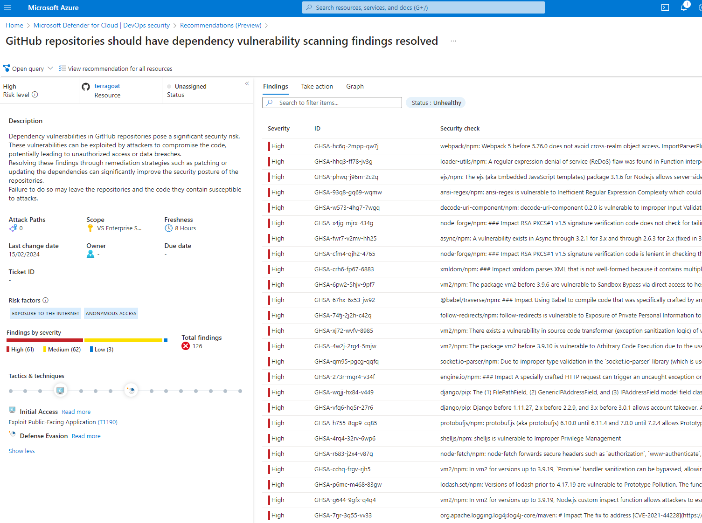
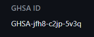
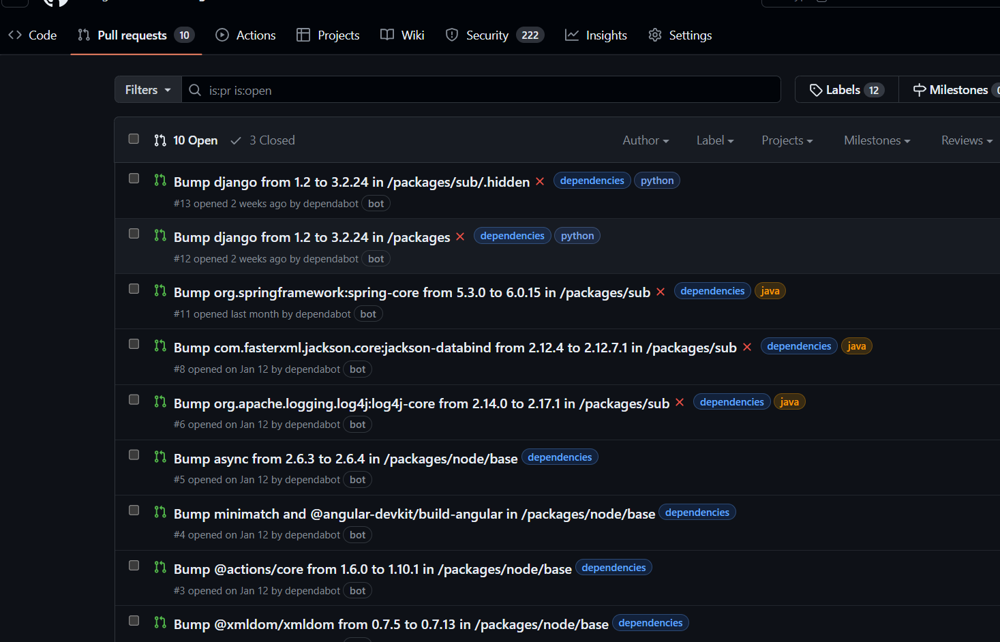
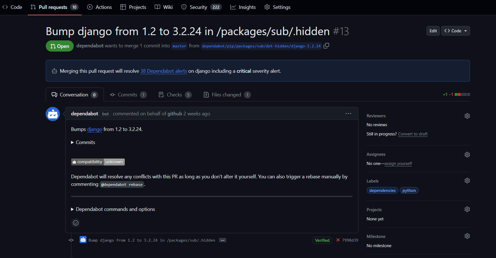
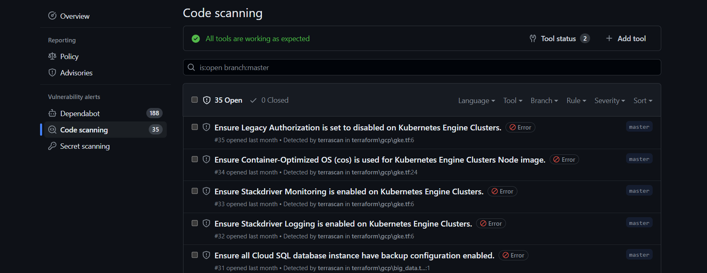

+++
title = 'Investigate and Remediate DevOps Security findings in Microsoft Defender for Cloud'
date = '2024-02-28T09:00:00+00:00'
draft = false
slug = 'investigate-remediate-devops-security-defender-for-cloud'
tags = ['Microsoft Security', 'Defender for Cloud', 'DevSecOps', 'Azure', 'Infrastructure as Code']
description = 'Remediate code scanning findings in your GitHub repositories with Defender for Cloud'
+++

In my previous blog [DevOps Security with Microsoft Defender for Cloud](file:///C:/Users/craforsh/Repo/craigforshaw.github.io/content/posts/devops-security-defender-for-cloud/index.md) I introduced the DevOps Security features in Defender for Cloud and how you can link and scan your GitHub code repositories for vulnerabilities before they hit your infrastructure platforms.

In this blog I am going to focus on the options for fixing code issues based on the reporting findings from Defender for Cloud.

## Findings

As mentioned previously, all of the reporting from your connected repositories appears under findings in the security overview dashboard of DevOps Security.

To get some findings to remediate for this blog, I am using two vulnerable by design IaC code repositories developed by Bridgecrew:

[Terragoat](https://github.com/bridgecrewio/terragoat)

[Bicepgoat](https://github.com/bridgecrewio/bicepgoat)

These repositories are perfect for testing misconfigurations and vulnerabilities in a safe space. Be sure to keep them separate from your production environments if you are going to deploy this code!

Findings fall into the following categories:

**Code** — findings that are based on the CodeQL scanning in GitHub (CodeQL is the code analysis engine developed by GitHub to automate security checks).

**IaC** — IaC findings from the DevOps Security GitHub Action / Azure DevOps pipeline.

**Secrets** — Secrets scanned by GitHub advanced security.

**Dependencies** — Dependabot alerts from GitHub that include security updates and dependency version updates.

## Recommendations

In the security overview there is an option to view the DevOps environment posture management recommendations. This is a new overview that gives you a good insight into the detected vulnerabilities, their risk level and risk factors.

Using this overview we can prioritize the high level issues first and drill down further to each vulnerability that has been found. In this case we have some high priority dependency vulnerabilities in the code that need to be resolved.

## Fix code findings and dependencies

To start fixing code findings and dependencies we will need to do this within GitHub by opening the security tab of the code repository. Given the amount of security vulnerabilities in this case you can look for specific issues based on the GHSA ID. This is the ID that appears in the above severity report and in each dependency issue ID in GitHub.

To resolve the dependency issues GitHub automatically creates a series of pull requests that can be resolved.

Looking at the top pull request, dependabot has created this is a pull request that contains 38 fixes identified in the dependabot alerts above.

All that's needed here is to merge the pull request to automatically fix the issues in the code and this will remediate the fixes being alerted in both GitHub and eventually Defender for Cloud after a short polling period.

## Secrets

Secret scanning alerts are presented in the security tab under secrets scanning. The secrets are captured by GitHub advanced security and then are synchronised to Defender for Cloud. But what is defined here as a secret? It is any token or private key that is used to communicate with an external service. So keep that in mind as this isn't something thats going to capture an exposed virtual machine password for example. [The secret scanning partner program](https://docs.github.com/en/code-security/secret-scanning/secret-scanning-partner-program) provides some guidance on what is covered and how it works.

There is also an option to enable push protection for secrets which will prevent anyone pushing code to your repo that contains a secret.

## Fix IaC misconfigurations

To fix IaC misconfigurations, run the Microsoft Security DevOps scanner in CI—either the GitHub Microsoft Security DevOps Action or the Azure DevOps task. I covered the setup in my previous blog.

- Microsoft Security DevOps Action: https://github.com/marketplace/actions/microsoft-security-devops
- Microsoft Security DevOps for Azure DevOps: https://marketplace.visualstudio.com/items?itemName=ms-securitydevops.microsoft-security-devops-azdevops

There are two main scenarios you can use to run the action, firstly against an existing deployment on your main branch or against a branch pull request.

The first scenario will add any identified vulnerabilities to your code scanning section of the security tab in GitHub. These can then be remediated in your code directly, to fix the already deployed issues, or you can create a branch copy fix and re-run the action as part of a pull request annotation. This fit's nicely with the second scenario, introduction of new code.

This scenario is the method that will prevent vulnerabilities from hitting your environment in the first place. When a developer creates new code in a branch and initiates a pull request then the action will automatically scan the branch and add issues that need to be fixed directly in the pull request.

To show this further, I have created a video that shows an example of a simple azure storage account written in bicep code that has some missing security parameters and how to use the code scanning tools as part of a pull request to remediate them before they are deployed into your code.



## Summary

In summary, the tools available to remediate code issues from Defender for Cloud in combination with GitHub advanced security provide a wide area of protection. You have a full range of support for application code, IaC, secrets and dependencies that can be reported into Defender for Cloud.

Using the pull request integration feature for is also a nice way to include this action as a pre-requisite in your code environment allowing for developers to fix coding issues before they are deployed to your Azure environments.

